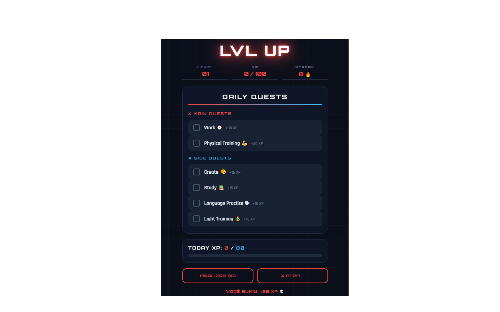
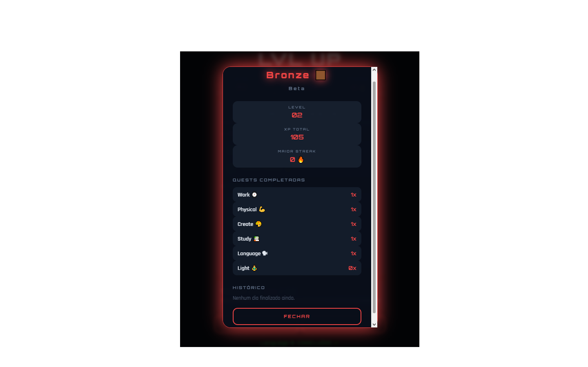
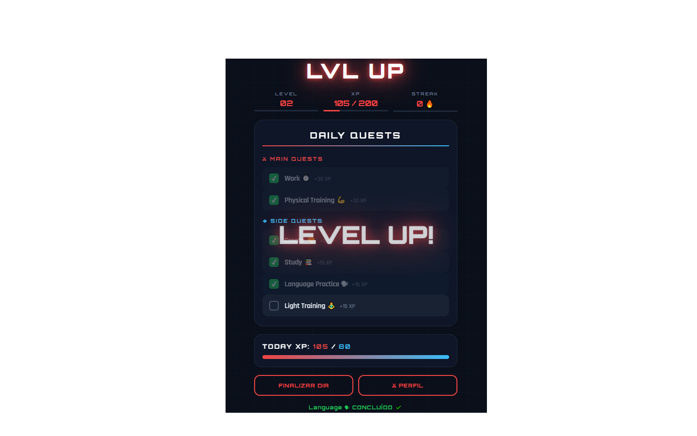

# ⚡ LVL UP

> Transforme sua rotina em uma RPG. Complete missões diárias, suba de level e construa a melhor versão de você mesmo.

🔗 **[Acessar o app](https://lvlupv2daluzcl.netlify.app)**

---

## 📸 Screenshots

---

## 🎮 O que é o LVL UP?

LVL UP é um **Progressive Web App (PWA)** de produtividade gamificada. A ideia é simples: sua vida real vira um jogo. Você completa missões do dia a dia, ganha XP, sobe de level e evolui de rank, tudo com visual estilo RPG.

Sem frescura. Sem enrolação. Ou você completa a meta ou perde XP.

---

## ⚔ Sistema de Quests

### Main Quests (30 XP cada)
- Work ⌚️
- Physical Training 💪

### Side Quests (15 XP cada)
- Create 🎨
- Study 📚
- Language Practice 🗣
- Light Training 🧘

**Meta diária: 80 XP**

---

## 🏆 Sistema de Ranks

| Level | Rank | Cor |
|-------|------|-----|
| 1–5 | Bronze 🟫 | Vermelho |
| 6–10 | Prata ⚪ | Cinza |
| 11–20 | Ouro 🟡 | Amarelo |
| 21–40 | Elite 🔵 | Azul |
| 41+ | Lendário 🟣 | Roxo |

Cada novo rank concede um **bônus de XP** automático.

---

## 💀 Punições

- **Não bater a meta diária:** -50 XP e streak zerado
- **Ficar mais de 1 dia sem acessar:** penalidade de `level × 20 XP`

---

## 🔥 Funcionalidades

- Sistema de XP, Level e Streak
- Ranks com cores dinâmicas
- Histórico dos últimos 7 dias
- Efeito visual de Level Up
- Sons para quests, level up e rank up
- Notificações push (10h, 20h e 23h)
- Instalável como PWA no celular e desktop
- 100% offline com Service Worker
- Dados salvos localmente via localStorage
- **⚡ FORGE** — mentor IA com personalidade brutalmente honesta, alimentado pela API da Anthropic via backend seguro

---

## ⚡ FORGE

O FORGE é o mentor IA do LVL UP. Ele conhece seus dados reais: level, XP, streak, quests completadas — e te cobra quando você falha. Reconhece vitórias mas já aponta o próximo desafio. Sem papo furado.

A comunicação com a API é feita via **Netlify Functions**, garantindo que a chave da API nunca fique exposta no código do frontend.

---

## 🛠 Tecnologias

- HTML, CSS e JavaScript puro
- PWA com Service Worker
- Netlify Functions (Node.js) para o backend do FORGE
- API da Anthropic (Claude)
- Hospedado no Netlify
- Versionado no GitHub

---

## 🚀 Em desenvolvimento

- [ ] Push notifications reais no celular
- [ ] Sistema de conta e progresso na nuvem

---

## 👨‍💻 Autor

Desenvolvido por **DaluzCL**, aprendendo a codar construindo coisas reais.

